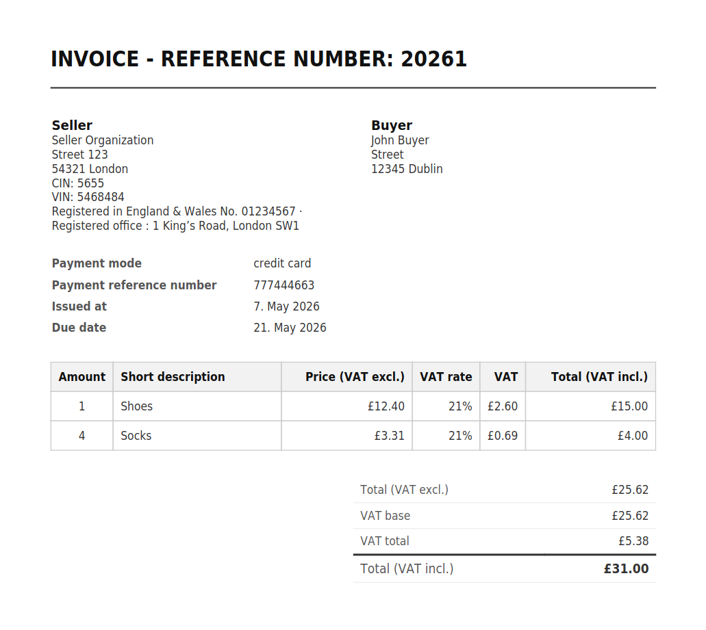

[Back to index](index.md)

Templates & styling 
===================

## Invoice templates

### mPDF and Twig
- Generate template supporting all invoice types:
``` bash
symfony console make:oib:invoice:mpdf_twig_template
```
#### Available styles: default
<figure>
    <a href="./assets/style/default_regular.png"></a>
    <figcaption>default</figcaption>
</figure>

### Available twig filters:
- `invoices_advance_totals` - Adds up totals of all advance invoices

## Invoice styler
- Is available only in the `dev` environment
- Requires you to implement the [binary provider](./pdf_generation.md)

### Usage
Enable the styler:
``` bash
symfony console oib:styler:enable
```

Then visit: /_oib/styler/`orderID`/`invoiceType`
- `orderID` - If the chosen order or the specified invoice doesn't exist, dummy order and invoice is used
- `invoiceType` - allowed values: regular, advance, proforma, final